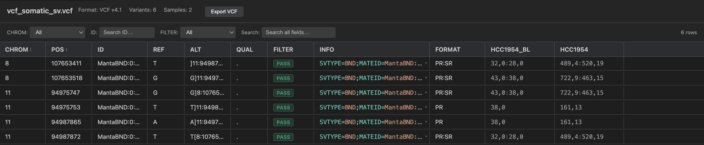

# BioFmt

Syntax highlighting, real-time validation, hover tooltips, and interactive previews for 25 genomics, transcriptomics, and proteomics file formats in VS Code.

## Features

- **Syntax highlighting** for all 25 formats
- **Real-time diagnostics** as you edit
- **Interactive previews** — virtualized tables with search, filters, and TSV export, handling 200K+ rows

## Supported Formats

**With validation:** VCF, SAM, BED, BEDPE, GTF, GFF3, PSL, PAF, WIG, bedGraph, narrowPeak, broadPeak

**Preview only:** MAF (alignment), MAF (mutation), GenBank, MTX, mzTab, MGF, Chain, Net, GFA, PED, MAP, GCT

## Installation

Search **BioFmt** in the VS Code Extensions panel (`Ctrl+Shift+X` / `Cmd+Shift+X`) and click Install.

## Usage

Open any supported file, then click the preview icon in the editor title bar (or run **BioFmt: Open Preview** from the Command Palette).

## Configuration

| Setting | Default | Description |
|---------|---------|-------------|
| `biofmt.preview.maxLines` | 200,000 | Max lines loaded in preview |
| `biofmt.preview.maxBytes` | 50 MB | Max file size for preview |
| `biofmt.preview.sampleColumnLimit` | 10 | VCF sample columns shown initially |
| `biofmt.validation.level` | `basic` | `off` / `basic` / `strict` |

## Requirements

VS Code 1.85.0 or higher.

## License

GPL-3.0 — see [LICENSE](LICENSE.txt).

## Changelog

See [CHANGELOG](CHANGELOG.md).
