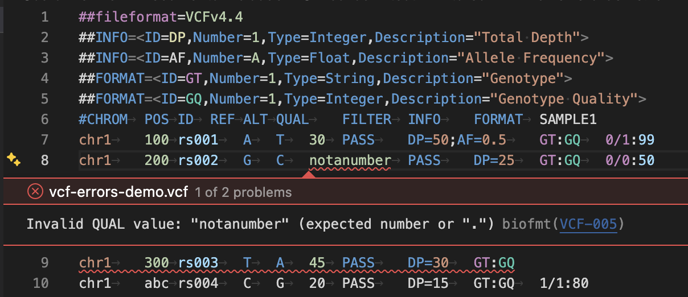
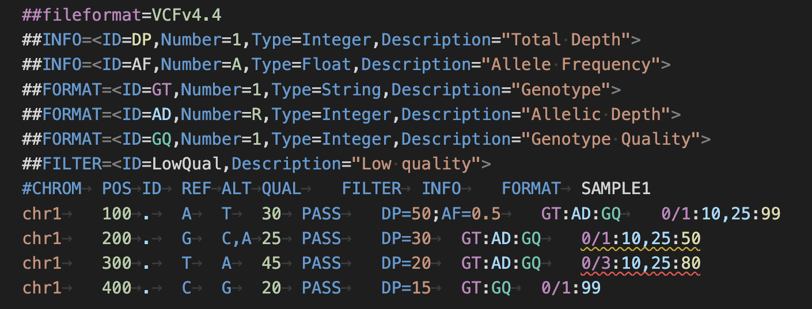
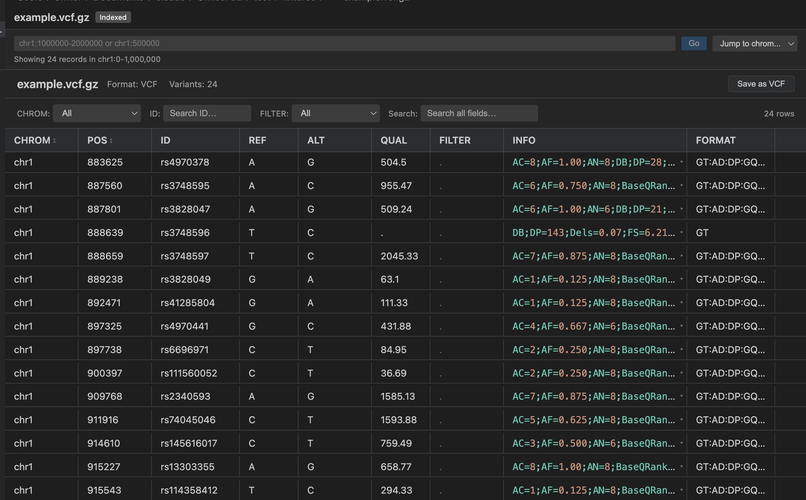

# BioFmt

Syntax highlighting, spec-referenced validation, and interactive previews for **27 genomics, transcriptomics, and proteomics formats** in VS Code — including indexed and binary files.

## Features

### Syntax Highlighting

TextMate grammars for all 27 formats with distinct coloring for field types, headers, and data regions. Works in any VS Code color theme.

### Spec-Referenced Diagnostics

Every diagnostic carries a rule code and a clickable link to the relevant format specification. Hover a squiggle to see which rule was violated and jump directly to the VCF v4.4, SAM v1, GFF3, or BED spec.

Three validation levels:

| Level | What it catches |
|-------|----------------|
| **off** | No validation |
| **basic** | Structural errors: wrong column count, non-integer coordinates, missing delimiters |
| **strict** (default) | Everything in basic, plus: REF/ALT format, CIGAR syntax, FILTER/FORMAT header declarations, genotype allele bounds, CIGAR vs SEQ length, GFF3 Parent resolution, and more |

Cross-field validation (strict mode) catches the errors that break pipelines:
- **VCF**: sample column count vs header, genotype allele index bounds, AD length vs allele count, INFO/FORMAT/FILTER header declarations
- **SAM**: CIGAR query length vs SEQ length, FLAG bit conflicts (unmapped + properly paired)
- **GFF3**: Parent attribute resolution (missing/duplicate IDs)

### Interactive Previews

Virtualized tables handle 200K+ rows with search, column sorting, drag-resizable columns, and TSV export. Format-specific views include:

- **VCF**: color-coded INFO/FORMAT fields, sample hover tooltips, FILTER badges, chromosome sorting
- **SAM/BAM**: FLAG decoding, tag parsing, alignment details
- **WIG/bedGraph**: interactive track plots with downsampling
- **MGF**: spectrum plots
- **GenBank**: feature outline view
- **GFA**: tabbed segments/links/paths view
- **FASTA**: per-base coloring (A/T/G/C/N)
- **FASTQ**: quality heatmap with Phred score color gradient

### Indexed & Binary File Support

Open compressed and indexed files directly — no decompression needed:

- `.vcf.gz` + `.tbi`/`.csi` (tabix)
- `.bed.gz` + `.tbi`/`.csi` (tabix)
- `.gff3.gz` + `.tbi`/`.csi` (tabix)
- `.bam` + `.bai`/`.csi`

Navigate by genomic region with the built-in region bar. Type `chr1:1000000-2000000` for a range, `chr1:500000` for a 10kb window around a position, or select a chromosome from the dropdown.

### Workspace-Wide Lint

Validate all bioinformatics files across your workspace — not just the ones you have open. Diagnostics appear in the VS Code **Problems** panel, making it easy to clean up datasets or audit file collections.

Enable with `biofmt.workspace.enableLint`. Off by default.

## Supported Formats

### Validated formats with specialized previews

| Format | Extensions | Indexed |
|--------|-----------|---------|
| VCF | `.vcf` | `.vcf.gz` + `.tbi`/`.csi` |
| SAM / BAM | `.sam` | `.bam` + `.bai`/`.csi` |
| BED | `.bed` | `.bed.gz` + `.tbi`/`.csi` |
| BEDPE | `.bedpe` | |
| GTF | `.gtf` | |
| GFF3 | `.gff`, `.gff3` | `.gff3.gz` + `.tbi`/`.csi` |
| FASTA | `.fasta`, `.fa`, `.fna`, `.ffn`, `.faa`, `.frn` | |
| FASTQ | `.fastq`, `.fq` | |
| PSL | `.psl` | |
| PAF | `.paf` | |
| WIG | `.wig` | |
| bedGraph | `.bedGraph`, `.bdg` | |
| narrowPeak | `.narrowPeak` | |
| broadPeak | `.broadPeak` | |

### Specialized previews (no validation)

MAF (alignment), MAF (mutation), GenBank, MTX (Matrix Market), mzTab, MGF, Chain, Net, GFA

### Generic preview

PED, MAP, GCT, HTSeq, Salmon, Kallisto

## Installation

Search **BioFmt** in the VS Code Extensions panel (`Ctrl+Shift+X` / `Cmd+Shift+X`) and click Install.

## Usage

1. **Open** any supported file in VS Code
2. Click the **preview icon** in the editor title bar, or run **BioFmt: Open Preview** from the Command Palette (`Ctrl+Shift+P` / `Cmd+Shift+P`)
3. **Indexed/binary files** (`.vcf.gz`, `.bam`, etc.) open directly with a region navigator — type a coordinate to query
4. **Hover** over INFO or FORMAT keys in VCF data rows to see field definitions and spec references

## Configuration

### Validation

| Setting | Default | Description |
|---------|---------|-------------|
| `biofmt.validation.level` | `strict` | Validation strictness: `off`, `basic`, or `strict` |
| `biofmt.validation.maxDiagnostics` | `2000` | Maximum diagnostics reported per file |
| `biofmt.lsp.viewportBufferLines` | `500` | Number of lines around the cursor to validate |

### Previews

| Setting | Default | Description |
|---------|---------|-------------|
| `biofmt.preview.maxLines` | `200000` | Maximum lines loaded in preview |
| `biofmt.preview.maxBytes` | `52428800` | Maximum file size in bytes for preview (50 MB) |
| `biofmt.preview.sampleColumnLimit` | `10` | VCF sample columns shown initially |
| `biofmt.preview.downsampleLimit` | `200000` | Track plot point limit before downsampling |
| `biofmt.preview.maxRegionRecords` | `10000` | Maximum records per region query (indexed files) |

### Workspace Lint

| Setting | Default | Description |
|---------|---------|-------------|
| `biofmt.workspace.enableLint` | `false` | Validate all bioinformatics files in the workspace |
| `biofmt.workspace.maxFiles` | `100` | Maximum number of files to validate |
| `biofmt.workspace.maxFileSizeMB` | `10` | Maximum file size (MB) for workspace validation |

## Requirements

VS Code 1.85.0 or higher.

## License

GPL-3.0 — see [LICENSE](LICENSE.txt).

## Changelog

See [CHANGELOG](CHANGELOG.md).
