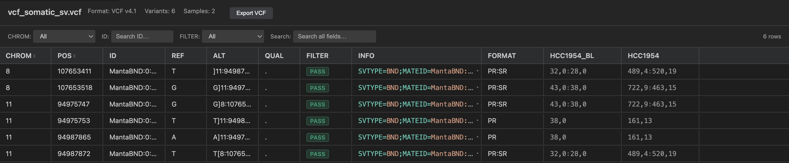
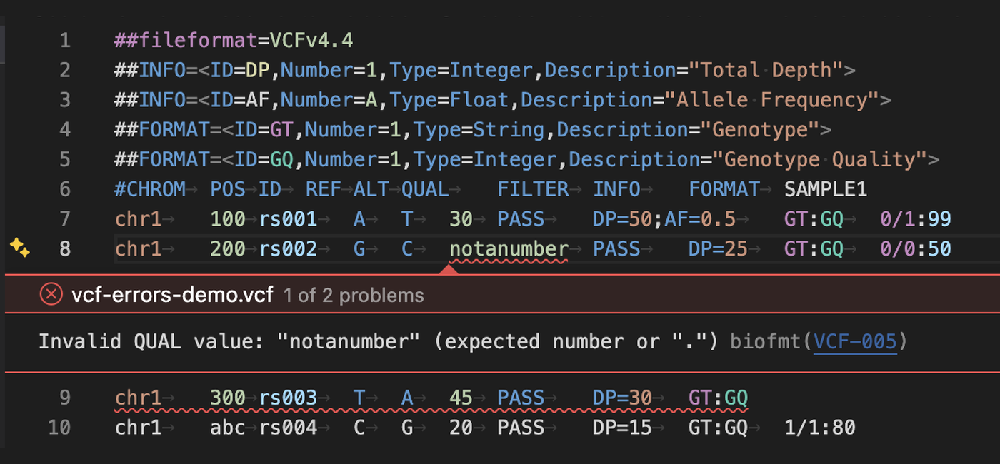
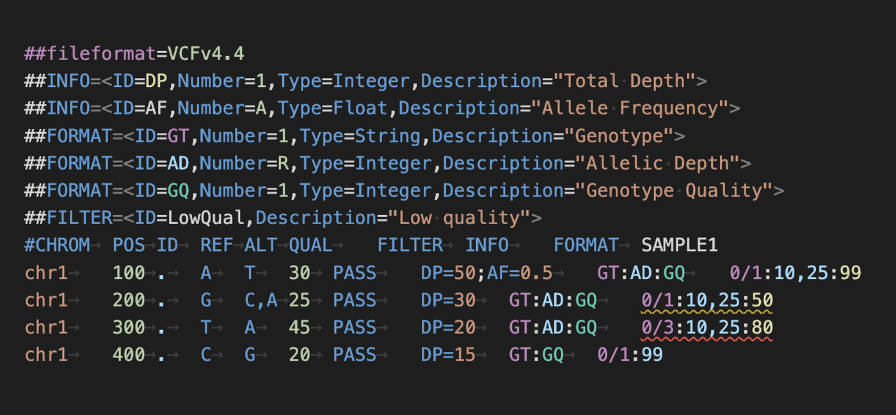
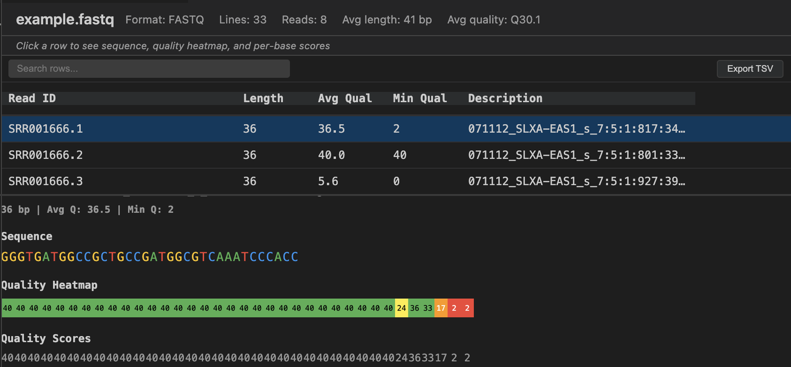
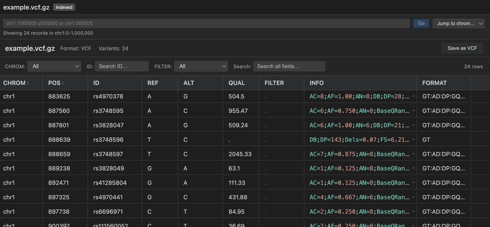
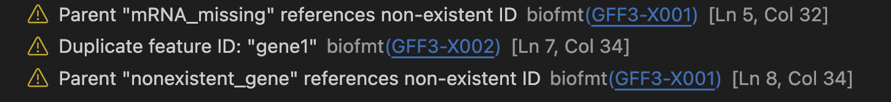

# BioFmt

Syntax highlighting, spec-referenced validation, and interactive previews for **27 genomics, transcriptomics, and proteomics formats** in VS Code, including indexed and binary files.

*Interactive VCF preview shown with [`test/fixtures/vcf_somatic_sv.vcf`](test/fixtures/vcf_somatic_sv.vcf).*

## What BioFmt Does

| Capability | What you get |
|------------|--------------|
| Syntax highlighting | TextMate grammars for headers, fields, records, intervals, alignments, and sequence data across supported formats. |
| Spec-referenced diagnostics | Validation squiggles include stable rule codes and links to the relevant public format specification. |
| Interactive previews | Virtualized tables, search, sorting, drag-resizable columns, format-specific renderers, and TSV export for large files. |
| Indexed and binary files | Direct opening for `.vcf.gz`, `.bed.gz`, `.gff3.gz`, and `.bam` with genomic region navigation. |
| Workspace lint | Optional workspace-wide validation that reports file issues in the VS Code Problems panel. |

## Feature Gallery

| Diagnostics | Strict validation |
|-------------|-------------------|
|  |  |
| Hover a squiggle to see the violated rule and jump to the source specification. Shown with [`test/fixtures/vcf-errors-demo.vcf`](test/fixtures/vcf-errors-demo.vcf). | Strict mode catches cross-field and semantic issues that basic structure checks miss. |

| FASTQ quality view | Indexed region navigation |
|--------------------|---------------------------|
|  |  |
| Inspect per-base quality with a Phred score heatmap. Shown with [`test/fixtures/example.fastq`](test/fixtures/example.fastq). | Query indexed genomic files by coordinates without decompressing them first. Shown with [`test/fixtures/example.vcf.gz`](test/fixtures/example.vcf.gz). |

| Workspace lint |
|----------------|
|  |
| Validate supported files across a workspace and review issues in the Problems panel. Enable with `biofmt.workspace.enableLint`. |

## Validation

BioFmt supports three validation levels:

| Level | What it catches |
|-------|-----------------|
| `off` | No validation |
| `basic` | Structural errors such as wrong column counts, invalid coordinates, and missing delimiters |
| `strict` (default) | Everything in `basic`, plus format-specific checks such as REF/ALT syntax, CIGAR consistency, header declarations, genotype allele bounds, GFF3 references, and duplicate/conflicting IDs |

Strict cross-field validation catches issues that commonly break pipelines:

| Format | Examples |
|--------|----------|
| VCF | Sample column count vs header, genotype allele bounds, AD length vs allele count, INFO/FORMAT/FILTER declarations |
| SAM | CIGAR query length vs SEQ length, FLAG conflicts |
| GFF3 | Attribute grammar, Parent and Derives_from resolution, repeated-ID consistency, parent cycles, sequence-region bounds |

## Interactive Previews

Preview panels are tailored to the file type rather than showing every format as plain text.

| Format family | Preview features |
|---------------|------------------|
| VCF | INFO/FORMAT parsing, sample hover tooltips, FILTER badges, chromosome sorting |
| SAM/BAM | FLAG decoding, tag parsing, alignment details |
| WIG/bedGraph | Downsampled track plots |
| MGF | Spectrum plots |
| GenBank | Feature outline view |
| GFA | Segments, links, and paths tabs |
| FASTA | Per-base coloring for A/T/G/C/N |
| FASTQ | Per-base quality heatmap |

## Indexed and Binary Files

Open compressed and indexed files directly:

| File | Required index |
|------|----------------|
| `.vcf.gz` | `.tbi` or `.csi` |
| `.bed.gz` | `.tbi` or `.csi` |
| `.gff3.gz` | `.tbi` or `.csi` |
| `.bam` | `.bai` or `.csi` |

Use the region bar to query `chr1:1000000-2000000`, a 10 kb window around `chr1:500000`, or a selected chromosome.

## Supported Formats

### Validated formats with specialized previews

| Format | Extensions | Indexed |
|--------|------------|---------|
| VCF | `.vcf` | `.vcf.gz` + `.tbi`/`.csi` |
| SAM / BAM | `.sam` | `.bam` + `.bai`/`.csi` |
| BED | `.bed` | `.bed.gz` + `.tbi`/`.csi` |
| BEDPE | `.bedpe` | |
| GTF | `.gtf` | |
| GFF3 | `.gff`, `.gff3` | `.gff3.gz` + `.tbi`/`.csi` |
| FASTA | `.fasta`, `.fa`, `.fna`, `.ffn`, `.faa`, `.frn` | |
| FASTQ | `.fastq`, `.fq` | |
| PSL | `.psl` | |
| PAF | `.paf` | |
| WIG | `.wig` | |
| bedGraph | `.bedGraph`, `.bdg` | |
| narrowPeak | `.narrowPeak` | |
| broadPeak | `.broadPeak` | |

### Specialized previews without validation

MAF alignment, MAF mutation, GenBank, MTX Matrix Market, mzTab, MGF, Chain, Net, GFA.

### Generic previews

PED, MAP, GCT, HTSeq, Salmon, Kallisto.

## Installation

Search **BioFmt** in the VS Code Extensions panel (`Ctrl+Shift+X` / `Cmd+Shift+X`) and click Install.

## Usage

1. Open any supported file in VS Code.
2. Click the preview icon in the editor title bar, or run **BioFmt: Open Preview** from the Command Palette (`Ctrl+Shift+P` / `Cmd+Shift+P`).
3. For indexed or binary files, use the region navigator to query a coordinate or chromosome.
4. Hover over diagnostics or VCF INFO/FORMAT keys to see rule, field, and specification details.

## Configuration

### Validation

| Setting | Default | Description |
|---------|---------|-------------|
| `biofmt.validation.level` | `strict` | Validation strictness: `off`, `basic`, or `strict` |
| `biofmt.validation.maxDiagnostics` | `2000` | Maximum diagnostics reported per file |
| `biofmt.lsp.viewportBufferLines` | `500` | Number of lines around the cursor to validate |

### Previews

| Setting | Default | Description |
|---------|---------|-------------|
| `biofmt.preview.maxLines` | `200000` | Maximum lines loaded in preview |
| `biofmt.preview.maxBytes` | `52428800` | Maximum file size in bytes for preview (50 MB) |
| `biofmt.preview.sampleColumnLimit` | `10` | VCF sample columns shown initially |
| `biofmt.preview.downsampleLimit` | `200000` | Track plot point limit before downsampling |
| `biofmt.preview.maxRegionRecords` | `10000` | Maximum records per region query (indexed files) |

### Workspace Lint

| Setting | Default | Description |
|---------|---------|-------------|
| `biofmt.workspace.enableLint` | `false` | Validate all bioinformatics files in the workspace |
| `biofmt.workspace.maxFiles` | `100` | Maximum number of files to validate |
| `biofmt.workspace.maxFileSizeMB` | `10` | Maximum file size in MB for workspace validation |

## Requirements

VS Code 1.85.0 or higher.

## License

GPL-3.0. See [LICENSE](LICENSE).

## Changelog

See [CHANGELOG](CHANGELOG.md).
